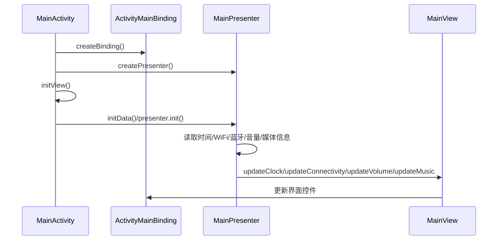
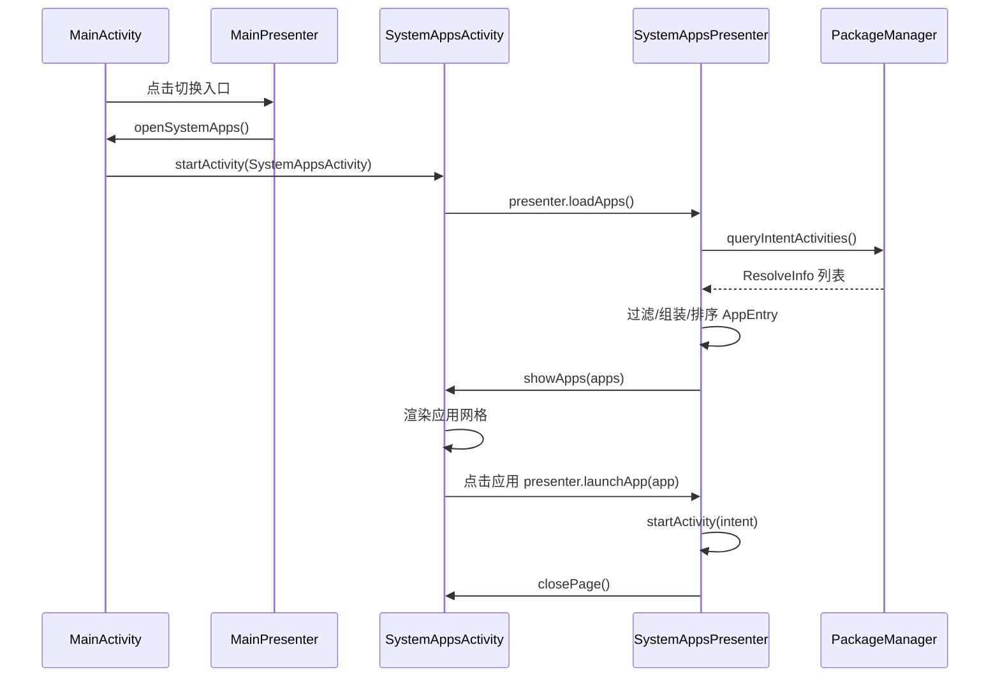

# HiviLauncher 项目结构与架构整理 PRD

- 文档版本：V1.0
- 创建日期：2026-07-07
- 项目路径：`D:\hivi2\HiviLauncher`
- 参考项目：`D:\hivi2\HiviAudio`
- 适用范围：HiviLauncher Android 应用的代码结构、界面组织、MVP 分层、系统应用列表实现方式与后续维护规范

## 1. 文档目的

本文档用于沉淀 HiviLauncher 当前项目结构与业务逻辑整理方案，明确后续开发、维护、扩展时应遵循的目录规范、架构规范和验收标准。

本次整理的核心目标是参考 HiviAudio 项目的分层方式，将 HiviLauncher 从“界面、业务、系统调用集中在 Activity 内”的实现方式，调整为更清晰、可继承、可维护的 MVP + ViewBinding 架构，并按界面模块拆分代码目录。

## 2. 背景说明

HiviLauncher 是面向智能安卓音响设备的专用 HOME 桌面应用，主要承载以下能力：

1. 作为系统默认桌面入口。
2. 展示设备主界面，包括时间、日期、WiFi、蓝牙、天气占位、音量、媒体信息等。
3. 提供音量调节、音乐应用启动、系统设置、屏保设置等快捷入口。
4. 提供系统应用列表，便于用户从桌面切换打开其他应用。

原始实现中，主界面逻辑容易集中在 `MainActivity` 内，包括：

- View 初始化与布局尺寸适配。
- 系统状态监听。
- WiFi、蓝牙、音量、媒体会话读取。
- 第三方音乐应用启动。
- 系统应用列表查询与展示。

随着功能增加，该方式会导致 Activity 体积变大、职责不清晰、复用困难、测试困难。因此需要进行项目结构和架构整理。

## 3. 产品目标

### 3.1 总体目标

建立一套适合 HiviLauncher 后续迭代的 Android 项目结构，使界面层、业务逻辑层、数据模型层、通用能力层职责清晰，降低维护成本。

### 3.2 具体目标

| 编号 | 目标 | 说明 |
| --- | --- | --- |
| G1 | 引入 MVP 架构 | Activity 只负责 UI 展示和用户交互转发，业务逻辑下沉到 Presenter。 |
| G2 | 使用 ViewBinding 组织界面 | 替代手写 `findViewById`，提高类型安全和可读性。 |
| G3 | 建立基础类 | 提供 `BaseActivity`、`BasePresenter`、`BaseView`，统一生命周期和公共行为。 |
| G4 | 优化目录结构 | 按界面模块建立目录，每个模块内包含 `ui`、`model`、`presenter`。 |
| G5 | 独立工具和自定义视图目录 | 将工具类放入 `utils`，将自定义 View 和 Drawable 放入 `customview`。 |
| G6 | 系统应用列表 Activity 化 | 系统应用列表使用独立 Activity 实现，不再使用 Dialog 承载主要页面。 |
| G7 | 保持 HOME 桌面能力 | 重构后仍保持 Launcher/HOME 启动能力和横屏全屏体验。 |

## 4. 用户与使用场景

### 4.1 目标用户

1. 智能音响设备终端用户。
2. HiviLauncher 项目开发人员。
3. 系统集成和量产维护人员。

### 4.2 核心使用场景

| 场景 | 用户行为 | 系统响应 |
| --- | --- | --- |
| 启动桌面 | 设备开机或按 HOME 键 | 进入 HiviLauncher 主界面。 |
| 查看设备状态 | 用户查看顶部状态区域 | 展示 WiFi、蓝牙、时间、日期等信息。 |
| 调节音量 | 点击音量加/减 | 调节 `AudioManager.STREAM_MUSIC` 音量并刷新音量表盘。 |
| 打开音乐应用 | 点击音乐卡片 | 按优先级启动已安装的 QQ 音乐、网易云音乐或酷狗音乐。 |
| 打开设置 | 点击设置入口 | 跳转系统设置。 |
| 打开屏保设置 | 点击屏保入口 | 跳转系统屏保设置。 |
| 查看全部应用 | 点击“切换”入口 | 打开系统应用列表 Activity。 |
| 启动其他应用 | 在应用列表中点击应用 | 启动目标应用并关闭应用列表页面。 |

## 5. 功能需求

### 5.1 主界面模块 main

#### 5.1.1 模块定位

`main` 模块承载 Launcher 主界面，负责设备桌面核心信息展示和快捷入口交互。

#### 5.1.2 目录要求

```text
com.hivi.launcher.main
├── model
│   ├── MainStatus.java
│   └── MusicInfo.java
├── presenter
│   └── MainPresenter.java
└── ui
    ├── MainActivity.java
    └── MainView.java
```

#### 5.1.3 UI 层职责

`MainActivity` 应继承基础 Activity：

```java
BaseActivity<ActivityMainBinding, MainPresenter>
```

职责范围：

1. 创建 ViewBinding。
2. 创建 Presenter。
3. 初始化界面布局、背景、图标、点击事件。
4. 注册和注销与界面生命周期相关的广播接收器。
5. 实现 `MainView`，接收 Presenter 回调并更新 UI。
6. 打开系统应用列表 Activity。

不得承担以下职责：

1. 直接编写 WiFi、蓝牙、音量、媒体会话等业务计算逻辑。
2. 直接查询和排序系统应用列表。
3. 将复杂业务流程写入点击事件内部。

#### 5.1.4 Presenter 层职责

`MainPresenter` 负责主界面业务逻辑：

1. 时间、日期定时刷新。
2. WiFi 连接状态读取。
3. 蓝牙 A2DP 连接状态读取。
4. 音量百分比读取与调节。
5. 媒体会话标题和歌手信息读取。
6. 第三方音乐应用启动。
7. 通知 View 打开系统应用列表。

#### 5.1.5 Model 层职责

`MainStatus`：主界面聚合状态模型，用于表达 WiFi、蓝牙、音量、音乐等状态。

`MusicInfo`：音乐信息模型，用于表达标题和艺术家信息。

### 5.2 系统应用列表模块 systemapps

#### 5.2.1 模块定位

`systemapps` 模块用于展示可启动的系统应用和第三方应用列表，并支持点击启动应用。

#### 5.2.2 目录要求

```text
com.hivi.launcher.systemapps
├── model
│   └── AppEntry.java
├── presenter
│   └── SystemAppsPresenter.java
└── ui
    ├── SystemAppsActivity.java
    └── SystemAppsView.java
```

#### 5.2.3 UI 层职责

`SystemAppsActivity` 应继承基础 Activity：

```java
BaseActivity<ActivitySystemAppsBinding, SystemAppsPresenter>
```

职责范围：

1. 创建应用列表页面 ViewBinding。
2. 初始化页面背景、关闭按钮、窗口尺寸。
3. 渲染应用网格。
4. 将应用点击事件转发给 Presenter。
5. 实现 `SystemAppsView`，接收应用列表数据并刷新界面。

#### 5.2.4 Presenter 层职责

`SystemAppsPresenter` 负责：

1. 查询带有 `Intent.ACTION_MAIN` + `Intent.CATEGORY_LAUNCHER` 的可启动应用。
2. 组装 `AppEntry` 模型。
3. 按中文排序规则排序应用列表。
4. 启动用户点击的应用。
5. 启动成功后通知 View 关闭页面。
6. 启动失败或列表为空时通知 View 提示用户。

#### 5.2.5 Model 层职责

`AppEntry` 用于承载应用信息：

1. 应用显示名称。
2. 包名。
3. Activity 类名。
4. 应用图标。

### 5.3 base 基础层

#### 5.3.1 目录要求

```text
com.hivi.launcher.base
├── BaseActivity.java
├── BasePresenter.java
└── BaseView.java
```

#### 5.3.2 BaseView

`BaseView` 是所有 View 接口的基础接口，应提供通用 UI 能力，例如：

```java
void showToast(String message);
```

#### 5.3.3 BasePresenter

`BasePresenter<V extends BaseView>` 应提供：

1. View 弱引用持有，降低 Activity 泄漏风险。
2. `attach` / `detach` 生命周期方法。
3. 主线程 Handler 能力。
4. 延迟任务和移除任务能力。
5. `detach` 时清理 Handler callback 和 View 引用。

#### 5.3.4 BaseActivity

`BaseActivity<B extends ViewBinding, P extends BasePresenter<?>>` 应提供：

1. ViewBinding 统一创建流程。
2. Presenter 统一创建与销毁流程。
3. 全屏沉浸式 UI 设置。
4. 保持屏幕常亮。
5. 通用 Toast 展示。
6. `initView` / `initData` 生命周期模板方法。

### 5.4 utils 工具层

#### 5.4.1 目录要求

```text
com.hivi.launcher.utils
└── UiUtils.java
```

#### 5.4.2 职责要求

`utils` 目录用于存放无业务状态、可复用的工具类。当前应包含 UI 尺寸适配和布局参数设置能力，例如：

1. 基于屏幕宽度的 UI 缩放。
2. dp 转 px。
3. LinearLayout 尺寸设置。
4. LinearLayout margin 设置。
5. 带权重的 LinearLayout 参数设置。

后续新增工具类时，应遵循以下原则：

1. 不持有 Activity 长生命周期引用。
2. 不包含具体业务流程。
3. 命名表达清晰，例如 `UiUtils`、`PackageUtils`、`DeviceUtils`。

### 5.5 customview 自定义视图层

#### 5.5.1 目录要求

```text
com.hivi.launcher.customview
├── AppIconDrawable.java
├── CircleDrawable.java
├── ClockFaceView.java
├── DashedBorderDrawable.java
├── PlayDrawable.java
├── RecordView.java
├── RoundRectDrawable.java
├── StatusIconDrawable.java
├── VolumeDialView.java
└── WeatherView.java
```

#### 5.5.2 职责要求

`customview` 目录用于存放自定义 View、自定义 Drawable、纯绘制相关代码。

该目录代码应聚焦 UI 绘制，不应包含：

1. 应用启动逻辑。
2. 系统状态读取逻辑。
3. 数据查询和排序逻辑。
4. 与 Activity 生命周期强绑定的业务逻辑。

### 5.6 ViewBinding 要求

#### 5.6.1 Gradle 配置

应用模块必须开启 ViewBinding：

```gradle
android {
    buildFeatures {
        viewBinding true
    }
}
```

#### 5.6.2 使用规范

1. Activity 不再使用 `findViewById` 获取控件。
2. 所有布局控件通过生成的 Binding 类访问。
3. Binding 生命周期由 `BaseActivity` 管理。
4. `onDestroy` 时应释放 Binding 引用。
5. 列表 item 可使用对应 item binding 创建，例如 `ItemAppGridBinding`。

## 6. 非功能需求

### 6.1 可维护性

1. Activity 保持 UI 职责，不承载复杂业务。
2. Presenter 独立承载业务逻辑。
3. Model 只表达数据结构，不直接依赖 View。
4. 工具类和自定义视图代码独立目录管理。
5. 新功能优先按模块拆分，避免堆积到根包。

### 6.2 可扩展性

1. 新增界面时，在 `com.hivi.launcher` 下按模块新建目录。
2. 每个界面模块默认包含 `ui`、`presenter`、`model` 三层。
3. 多页面复杂模块可在 `ui` 下继续拆分 `activity`、`fragment`、`adapter` 等目录。
4. Presenter 可复用 `BasePresenter` 的生命周期和主线程能力。

### 6.3 稳定性

1. Presenter 不应长期持有 Activity 强引用。
2. 定时任务、延迟任务必须在 `detach` 或相应生命周期中清理。
3. 系统广播注册与注销应成对出现。
4. 启动外部 Activity 时必须捕获异常并给予用户提示。
5. 查询系统应用时需过滤无效包名、无效 Activity 名称。

### 6.4 兼容性

1. 保持应用包名：`com.hivi.launcher`。
2. 保持 HOME/Launcher 入口能力。
3. 保持横屏全屏显示。
4. 保持 `minSdk 24`、`targetSdk 30`、`compileSdk 30` 的当前项目约束。
5. 保持 Android 11 / RK356X 预置场景可用。

### 6.5 性能

1. 主界面定时刷新频率控制在 1 秒级，避免过度刷新。
2. 系统应用列表在页面打开时加载，不在主界面启动时预加载。
3. 自定义 View 的绘制逻辑应避免频繁创建大对象。
4. 应用图标加载仅在列表渲染时进行，后续如列表规模过大可考虑缓存或 RecyclerView。

## 7. 当前目标目录结构

当前项目 Java 代码结构应整理为：

```text
D:\hivi2\HiviLauncher\app\src\main\java\com\hivi\launcher
├── HiviNotificationListener.java
├── base
│   ├── BaseActivity.java
│   ├── BasePresenter.java
│   └── BaseView.java
├── customview
│   ├── AppIconDrawable.java
│   ├── CircleDrawable.java
│   ├── ClockFaceView.java
│   ├── DashedBorderDrawable.java
│   ├── PlayDrawable.java
│   ├── RecordView.java
│   ├── RoundRectDrawable.java
│   ├── StatusIconDrawable.java
│   ├── VolumeDialView.java
│   └── WeatherView.java
├── main
│   ├── model
│   │   ├── MainStatus.java
│   │   └── MusicInfo.java
│   ├── presenter
│   │   └── MainPresenter.java
│   └── ui
│       ├── MainActivity.java
│       └── MainView.java
├── systemapps
│   ├── model
│   │   └── AppEntry.java
│   ├── presenter
│   │   └── SystemAppsPresenter.java
│   └── ui
│       ├── SystemAppsActivity.java
│       └── SystemAppsView.java
└── utils
    └── UiUtils.java
```

布局资源结构：

```text
D:\hivi2\HiviLauncher\app\src\main\res\layout
├── activity_main.xml
├── activity_system_apps.xml
└── item_app_grid.xml
```

## 8. Manifest 要求

### 8.1 主界面 Activity

主界面应声明为 HOME 入口：

```xml
<activity
    android:name=".main.ui.MainActivity"
    android:exported="true"
    android:launchMode="singleTask"
    android:screenOrientation="landscape">
    <intent-filter>
        <action android:name="android.intent.action.MAIN" />
        <category android:name="android.intent.category.HOME" />
        <category android:name="android.intent.category.DEFAULT" />
        <category android:name="android.intent.category.LAUNCHER" />
    </intent-filter>
</activity>
```

### 8.2 系统应用列表 Activity

系统应用列表应作为内部页面，不对外导出：

```xml
<activity
    android:name=".systemapps.ui.SystemAppsActivity"
    android:exported="false"
    android:excludeFromRecents="true"
    android:screenOrientation="landscape"
    android:theme="@style/AppTheme" />
```

### 8.3 权限要求

应用根据当前功能需要保留以下权限：

| 权限 | 用途 |
| --- | --- |
| `ACCESS_NETWORK_STATE` | 判断当前网络连接状态。 |
| `ACCESS_WIFI_STATE` | 获取 WiFi 信息。 |
| `BLUETOOTH` | 获取蓝牙状态。 |
| `MEDIA_CONTENT_CONTROL` | 读取媒体会话信息，系统/预置场景下使用。 |
| `MODIFY_AUDIO_SETTINGS` | 调节媒体音量。 |
| `QUERY_ALL_PACKAGES` | 查询可启动应用列表，Android 11 场景下需要注意包可见性。 |

## 9. MVP 调用流程

### 9.1 主界面初始化流程



### 9.2 系统应用列表流程



## 10. 开发规范

### 10.1 新增页面规范

新增页面时应遵循以下结构：

```text
com.hivi.launcher.<module>
├── model
├── presenter
└── ui
```

示例：新增网络设置模块：

```text
com.hivi.launcher.network
├── model
│   └── WifiEntry.java
├── presenter
│   └── NetworkPresenter.java
└── ui
    ├── NetworkActivity.java
    └── NetworkView.java
```

### 10.2 命名规范

| 类型 | 命名示例 | 说明 |
| --- | --- | --- |
| Activity | `MainActivity` | 页面 UI 实现。 |
| View 接口 | `MainView` | Activity 实现的 UI 回调接口。 |
| Presenter | `MainPresenter` | 页面业务逻辑。 |
| Model | `MusicInfo` | 页面或业务数据模型。 |
| 工具类 | `UiUtils` | 静态工具能力。 |
| 自定义 View | `VolumeDialView` | 纯 UI 控件。 |
| Drawable | `RoundRectDrawable` | 绘制类。 |

### 10.3 Activity 编码规范

Activity 内允许存在：

1. Binding 初始化。
2. Presenter 创建。
3. 控件尺寸和样式设置。
4. 点击事件绑定。
5. View 接口实现。
6. 与 Activity 生命周期强相关的注册/注销操作。

Activity 内不建议存在：

1. 大段业务判断。
2. 系统服务数据组装逻辑。
3. 列表查询、排序、过滤逻辑。
4. 网络、文件、数据库等耗时操作。
5. 可复用工具方法的重复实现。

### 10.4 Presenter 编码规范

Presenter 应遵循：

1. 通过 View 接口回调 UI，不直接操作 ViewBinding。
2. 不持有 Activity 强引用；如需 Context，优先使用 `getApplicationContext()`。
3. 需要 UI 提示时调用 `view.showToast()`。
4. 生命周期结束时清理 Handler、Runnable、监听器等。
5. 对系统 API 调用进行异常保护。

### 10.5 Model 编码规范

Model 应遵循：

1. 字段语义清晰。
2. 尽量不包含 Android UI 控件引用。
3. 必要时可包含 `Drawable` 等展示数据，但不应包含 View 或 Activity。
4. 不直接调用系统服务或启动页面。

## 11. 验收标准

### 11.1 目录结构验收

| 编号 | 验收项 | 标准 |
| --- | --- | --- |
| A1 | base 目录 | 存在 `BaseActivity`、`BasePresenter`、`BaseView`。 |
| A2 | utils 目录 | 存在 UI 工具类或通用工具类。 |
| A3 | customview 目录 | 自定义 View 和 Drawable 不再散落在根包。 |
| A4 | main 模块 | 存在 `ui`、`model`、`presenter` 三层。 |
| A5 | systemapps 模块 | 存在 `ui`、`model`、`presenter` 三层。 |
| A6 | 根包整洁 | 根包仅保留确有必要的全局组件，例如通知监听服务。 |

### 11.2 架构验收

| 编号 | 验收项 | 标准 |
| --- | --- | --- |
| B1 | ViewBinding | Activity 使用 Binding 访问布局控件。 |
| B2 | MVP | Activity 实现 View 接口，业务逻辑位于 Presenter。 |
| B3 | 生命周期 | Presenter 在 Activity 销毁时 detach。 |
| B4 | 任务清理 | 定时刷新任务可停止并清理。 |
| B5 | 应用列表 | 系统应用列表由 Activity 实现，不依赖 Dialog。 |

### 11.3 功能验收

| 编号 | 验收项 | 标准 |
| --- | --- | --- |
| C1 | HOME 启动 | 应用可作为默认桌面启动。 |
| C2 | 主界面显示 | 时间、日期、状态区域、音量、音乐卡片正常显示。 |
| C3 | 音量调节 | 点击音量加减后系统媒体音量变化，界面音量同步更新。 |
| C4 | 音乐入口 | 已安装目标音乐应用时可启动；未安装时提示用户。 |
| C5 | 设置入口 | 可打开系统设置。 |
| C6 | 屏保入口 | 可打开系统屏保设置。 |
| C7 | 应用列表入口 | 点击切换后进入系统应用列表 Activity。 |
| C8 | 应用启动 | 点击列表应用后可启动目标应用，并关闭列表页面。 |

### 11.4 构建验收

项目应能正常执行 Debug 构建：

```powershell
cd D:\hivi2\HiviLauncher
$env:JAVA_HOME='C:\Users\longjm\.jdks\ms-17.0.15'
.\gradlew.bat assembleDebug --no-daemon
```

期望结果：

```text
BUILD SUCCESSFUL
```

> 说明：当前 Gradle/AGP 版本对 JDK 版本敏感，建议使用 JDK 17 构建。若使用 Android Studio JBR 21，可能出现 `Unsupported class file major version 65` 相关错误。

## 12. 风险与约束

| 风险 | 说明 | 应对方式 |
| --- | --- | --- |
| 系统权限差异 | 媒体会话、包查询等能力在不同系统签名/权限下表现不同。 | 量产时使用系统预置或平台签名，并保留异常处理。 |
| 包可见性限制 | Android 11 对应用查询有包可见性限制。 | 保留 `QUERY_ALL_PACKAGES`，必要时补充 `<queries>`。 |
| 应用列表数量增大 | GridLayout 一次性渲染大量应用可能影响性能。 | 后续可升级为 RecyclerView。 |
| 字符串硬编码 | 当前部分提示文案和 UI 文案可能直接写在 Java/XML 中。 | 后续可统一迁移到 `strings.xml`。 |
| Manifest namespace 警告 | Manifest 中保留 package 属性时 AGP 可能给出弃用提示。 | 后续可在确认兼容后移除 Manifest `package` 属性。 |

## 13. 后续优化建议

1. 将硬编码中文文案迁移至 `res/values/strings.xml`。
2. 系统应用列表改为 RecyclerView，提高大量应用场景下性能和可维护性。
3. 为主界面状态读取补充单元测试或可替换的数据提供层。
4. 将 WiFi、蓝牙、媒体、音量等系统能力进一步抽象为独立 manager/service，便于 Presenter 更轻量。
5. 增加空状态、加载失败状态、无权限状态的统一 UI 展示。
6. 天气模块从静态占位升级为真实天气服务接入。
7. 根据量产设备分辨率补充 UI 自适应验证清单。

## 14. 本次整理交付物

| 类型 | 路径 | 说明 |
| --- | --- | --- |
| 基础架构 | `D:\hivi2\HiviLauncher\app\src\main\java\com\hivi\launcher\base` | MVP 基础类。 |
| 主界面模块 | `D:\hivi2\HiviLauncher\app\src\main\java\com\hivi\launcher\main` | 主界面三层结构。 |
| 应用列表模块 | `D:\hivi2\HiviLauncher\app\src\main\java\com\hivi\launcher\systemapps` | 系统应用列表三层结构。 |
| 工具目录 | `D:\hivi2\HiviLauncher\app\src\main\java\com\hivi\launcher\utils` | 通用工具类。 |
| 自定义视图目录 | `D:\hivi2\HiviLauncher\app\src\main\java\com\hivi\launcher\customview` | 自定义 View 和 Drawable。 |
| 应用列表页面布局 | `D:\hivi2\HiviLauncher\app\src\main\res\layout\activity_system_apps.xml` | Activity 化后的应用列表页面。 |
| PRD 文档 | `D:\hivi2\HiviLauncher\doc\HiviLauncher项目结构与架构整理PRD.md` | 本文档。 |

## 15. 结论

HiviLauncher 后续应以 MVP + ViewBinding 为基础架构，按页面模块组织代码，将 Activity 控制在 UI 层职责内，将业务逻辑迁移到 Presenter，将数据表达放入 Model，并通过 `base`、`utils`、`customview` 等公共目录沉淀可复用能力。

该结构与 HiviAudio 项目的组织方式保持一致，能够提升项目可读性、可维护性和后续功能扩展效率，同时保持当前 Launcher 的 HOME 桌面属性和系统应用列表能力。
