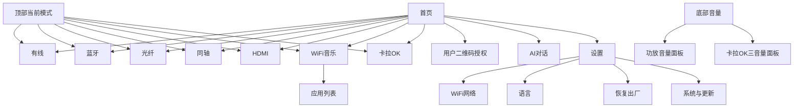
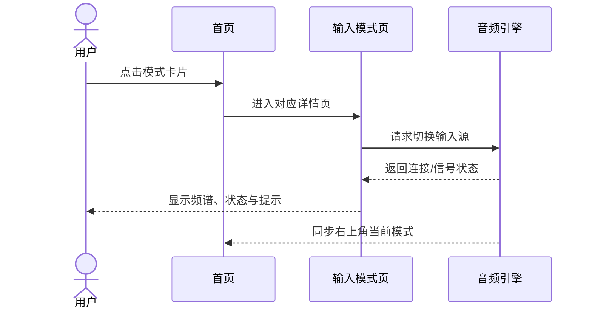
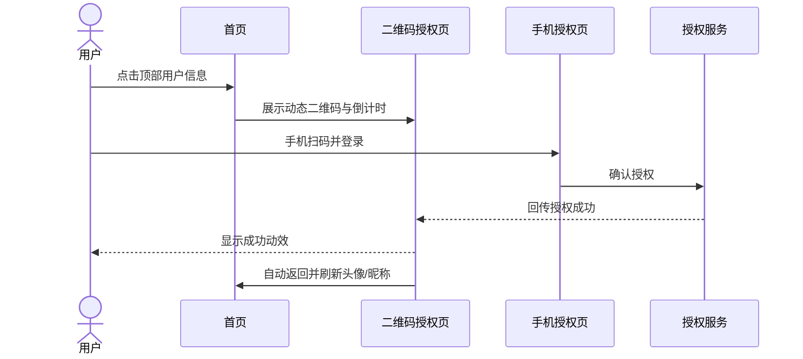

# Soundbar 带屏智能音响 UI 产品 PRD

- 文档版本：V1.0
- 文档属性：UI/UX 设计说明
- 创建日期：2026-07-15
- 参考：`mc-200pro ,lp2, IP100`
- 适用对象：UI 设计、交互设计、视觉设计、动效设计、Android 客户端开发
- 产品名称：Soundbar 带屏安卓智能音响（暂定名）

> 本文档以“设计师可以直接据此画页面”为目标。除非特别说明，文档中的音量、连接、播放状态均需要在界面上给出清晰的视觉反馈。硬件实现参数以最终声学和结构评审为准。

## 1. 产品定位

Soundbar 是一款横向带屏的 Android 智能音响。产品通过专业功放和 DSP 调音，驱动多个高音、中音、低音扬声器，提供高品质听感；同时支持家庭影院、音乐播放、蓝牙接收和一体化卡拉 OK 等场景。

### 1.1 产品关键词

`高音质`、`一屏直达`、`七种输入`、`专业调音`、`全局音量`、`家庭娱乐`、`简单易懂`。

### 1.2 目标用户

1. 希望电视、手机、游戏机和音响统一使用的家庭用户。
2. 对声音质量、音效模式和频谱可视化有兴趣的音乐用户。
3. 需要开箱即用、遥控器与麦克风配套的聚会和卡拉 OK 用户。
4. 需要在客厅横屏设备上快速切换信号源的用户。

### 1.3 核心设计目标

| 目标 | UI 设计要求 |
| --- | --- |
| 输入源一眼可选 | 主屏首屏展示七种模式，不隐藏在二级菜单 |
| 当前状态始终明确 | 左上角显示 WiFi/蓝牙状态，右上角显示当前输入模式 |
| 音量随时可调 | 底部“音量”入口一键弹出调节面板；普通模式只显示功放音量，卡拉 OK 显示三种音量 |
| 声音变化有反馈 | 输入切换、音量变化、连接变化都配合动效、数值或提示 |
| 为高音质服务 | 频谱、声道、采样率等信息作为辅助信息，不干扰主要操作 |
| 适配客厅距离 | 触控区域大、文字高对比、关键状态不依赖颜色单独表达 |

## 2. 产品与音频概念（供 UI 统一命名）

### 2.1 七种输入模式

| 编号 | UI 名称 | 英文名 | 典型设备/场景 | 是否显示 FFT |
| --- | --- | --- | --- | --- |
| 1 | 有线 | Line In | 手机、播放器、其他模拟音源 | 是 |
| 2 | 蓝牙 | Bluetooth | 手机、平板、电脑无线播放 | 是 |
| 3 | 光纤 | Optical | 电视、机顶盒、数字音频输出 | 是 |
| 4 | 同轴 | Coaxial | CD 机、电视、数字播放器 | 是 |
| 5 | HDMI | HDMI | 电视、游戏机、机顶盒、ARC/eARC | 是 |
| 6 | WiFi 音乐 | WiFi Music | 第三方音乐 App、网络音频 | 否（以内容卡片为主） |
| 7 | 卡拉 OK | Karaoke | 麦克风、遥控器、家庭聚会 | 是（叠加人声/伴奏状态） |

> 设计上统一使用“输入模式”而不是“播放模式”。“音效模式”仅指 DSP 声音风格，如电影、音乐、演唱会等，避免用户误解。

### 2.2 音量层级

| 音量名称 | 控制对象 | 出现范围 | 默认显示 |
| --- | --- | --- | --- |
| 功放音量 | 所有输入的主输出音量 | 所有页面底部固定控件 | 始终显示，如 `32/100` |
| 话筒音量 | 卡拉 OK 麦克风人声 | 仅卡拉 OK 页面 | 页面内独立滑杆 |
| 音效音量 | 卡拉 OK 人声效果强度 | 仅卡拉 OK 页面 | 页面内独立滑杆 |

功放音量为全局值。切换输入模式时保留功放音量；话筒音量和音效音量只在卡拉 OK 内保存，退出卡拉 OK 后不影响其他模式。

### 2.3 音频状态名词

- `已连接`：输入设备或网络已建立连接，可以播放。
- `未连接`：该输入暂时没有可用信号。
- `正在连接`：正在建立蓝牙、WiFi 或 HDMI 握手。
- `无信号`：接口存在，但当前没有有效音频流。
- `播放中`：音频流正在输出。
- `暂停`：音频源可用但暂时停止输出。
- `静音`：功放音量为 0 或用户主动静音。

## 3. 信息架构与导航

### 3.1 底部系统导航栏（一级导航）

底部系统导航栏是设备 UI 的全局一级导航，不随页面内容滚动，在全部产品页面始终可见。其作用是让用户在任意页面都能一键返回上级、回到首页、调节音量或打开设置；输入模式通过顶部右侧“当前模式”区域切换。

导航栏紧贴屏幕底部安全区。音量不再常驻占据屏幕空间，而由“音量”导航项点击后以底部抽屉弹出。常规状态下底部系统导航栏共 4 项；在 WiFi 音乐模式下增加“应用列表”，共 5 项。

| 导航项 | 图标建议 | 页面定位 | 选中状态 |
| --- | --- | --- | --- |
| 返回 | Back / Chevron Left | 返回上一级页面 | 二级及以上页面可用；首页根页面置灰 |
| 首页 | Home | 七种输入模式入口、状态总览 | 填充图标 + 高亮色 |
| 音量 | Volume / Speaker | 弹出当前模式对应的音量调节面板 | 点击态高亮；面板打开时保持高亮 |
| 设置 | Gear | WiFi、语言、恢复出厂、系统和关于 | 填充图标 + 高亮色 |
| 应用列表（仅 WiFi 音乐） | Apps / Grid | 查看并启动设备已安装的系统应用 | 仅 WiFi 音乐模式显示 |

音量面板关闭后，功放音量值仍持续生效；切换输入模式不重置功放音量。卡拉 OK 的话筒音量和音效音量仅在卡拉 OK 内保存。

#### 3.1.1 UI 布局与尺寸建议

```text
┌─────────────────────────────────────────────────────────────┐
│                                                             │
├─────────────────────────────────────────────────────────────┤
│  ‹ 返回        ◉ 首页        🔊 音量        ⚙ 设置         │
│             （选中态）                                     │
└─────────────────────────────────────────────────────────────┘
```

WiFi 音乐模式下，导航栏布局变为：

```text
│ ‹ 返回    ◉ 首页    🔊 音量    ▦ 应用列表    ⚙ 设置 │
```

- 导航栏背景使用独立深色/毛玻璃层，与内容区明显区分；顶部可加 1px 分割线。
- 常规四个入口等宽分布；WiFi 音乐模式的五个入口等宽分布，单项包含图标和文字；文字不可省略为纯图标。
- 建议导航栏高度 72–88dp，底部额外预留 Android 手势条/系统导航区域安全边距。
- 选中项使用高亮色、填充图标或底部指示条；未选中项采用低对比度线性图标。
- 点击导航项后仅切换内容区或弹出底部面板，顶部状态栏和底部系统导航栏保持固定。

#### 3.1.2 导航交互规则

| 用户操作 | 界面行为 |
| --- | --- |
| 点击“返回” | 返回最近一级页面；保留当前输入源、连接状态和功放音量 |
| 首页根页面点击“返回” | 按钮置灰不可用，不执行退出或关机操作 |
| 点击“首页” | 回到七种输入模式总览；不改变当前输入和功放音量 |
| 点击“音量” | 弹出音量调节底部抽屉；普通模式显示功放音量，卡拉 OK 显示功放、话筒、音效三种音量 |
| WiFi 音乐模式点击“应用列表” | 打开已安装系统应用列表；退出列表后返回 WiFi 音乐页 |
| 点击“设置” | 进入系统设置首页；可进入 WiFi、语言和恢复出厂 |
| 点击顶部右侧“当前模式” | 弹出七种输入模式选择面板；点击任一卡片后切换输入并进入相应详情页 |
| 进入任一输入详情页 | “首页”保持选中；顶部右侧始终展示当前输入模式 |
| 遥控器按返回键 | 与底部“返回”行为一致，优先返回上一级内容页；到首页根页面后不隐藏底部导航栏 |

#### 3.1.3 顶部“当前模式”选择面板

顶部导航栏右侧固定显示“当前：蓝牙”等当前输入信息。点击该区域后，从顶部当前模式区域下方弹出七种输入模式选择面板，不跳转独立页面。面板标题为“选择输入模式”，以 4+3 的大卡片网格展示：有线、蓝牙、光纤、同轴、HDMI、WiFi 音乐、卡拉 OK。

- 卡片包含模式图标、中文名、英文辅助文字和当前连接/信号状态。
- 当前模式卡片显示“当前使用”标签和高亮边框；点击当前模式仅关闭面板。
- 点击其他模式后，先显示“正在切换”，切换成功自动关闭面板并进入对应详情页；失败时保留面板并显示错误提示。
- 当前无信号的模式仍可点击，进入详情页后展示连接引导。
- 面板支持遥控器方向键逐项移动焦点，确认键切换，返回键关闭面板。

#### 3.1.4 WiFi 音乐模式“应用列表”

“应用列表”不是常规导航项，仅在当前输入模式为 WiFi 音乐时显示，用于浏览并启动设备内安装的系统应用。该入口位于“音量”和“设置”之间，图标建议为四宫格。

- 应用列表为全屏页面，顶部显示“应用列表”和返回入口；底部导航保持可见。
- 应用按图标网格排列，单项展示应用图标与名称，支持上下滚动和遥控器焦点。
- 支持显示音乐类应用的“音乐”分类标签；其他系统应用归入“全部”。
- 无已安装应用时显示空态：“暂无可用应用”。
- 从应用列表返回时，回到 WiFi 音乐页面，保留原音乐服务卡片的滚动位置。

### 3.2 信息架构图



### 3.3 页面通用布局

```text
┌─────────────────────────────────────────────────────────────┐
│ 左上：WiFi / 蓝牙状态   右上：用户信息（首页）｜当前输入（可点击）│
│                                                             │
│                     页面内容区                              │
│                                                             │
│                                      ◉ AI（首页右下角悬浮入口）│
│  ‹返回           首页           音量           设置           │
│  WiFi 音乐模式额外显示：应用列表                              │
└─────────────────────────────────────────────────────────────┘
```

- 顶部状态栏高度固定，页面滚动时不滚动。
- 内容区采用卡片和大留白，避免信息拥挤。
- 底部导航栏固定在底部安全区内；点击“音量”后在导航栏上方弹出音量抽屉。
- 建议横屏 16:9 作为主设计稿，兼容更宽屏幕时内容整体居中。

## 4. 视觉与交互基线

### 4.1 视觉方向

- 主色建议为深色黑/深灰背景，突出声音、频谱和专辑封面。
- 强调色建议使用蓝青色；连接成功使用绿色，警告使用橙色，错误使用红色。
- 卡片圆角建议 16–24dp；按钮圆角建议 12–16dp。
- 文字层级：页面标题 > 关键信息 > 辅助信息；中文与英文都需预留宽度。
- 频谱和波形使用渐变或柔和发光，但不能影响文字可读性。

### 4.2 触控与动效

- 主要按钮最小触控区域 48dp，遥控器焦点区域不小于 56dp。
- 输入模式切换：点击后卡片先高亮，顶部模式文字同步变化，音频状态在 300ms 内更新。
- 页面切换：左右滑动或点击卡片均可，采用 200–300ms 横向过渡。
- 音量调整：滑杆拖动实时反馈；松手后显示短暂数值气泡；音量变化不跳页。
- FFT 动效保持连续，断流时降为低幅度呼吸线，不闪烁、不消失。
- 长按音量滑杆支持快速连续调整；点击滑杆轨道可跳转到对应值。

### 4.3 状态表达原则

同一状态至少使用“图标 + 文字”或“图标 + 数值”表达，不仅依赖颜色。例如蓝牙已连接显示蓝牙图标、设备名和“已连接”。

## 5. 首页（输入模式总览）

### 5.1 页面目的

用户打开设备后可以立即知道当前连接状态、当前声音从哪里来，并一键进入七种输入模式。

### 5.2 页面布局

1. 左上角状态区：WiFi 图标、WiFi 名称/未连接；蓝牙图标、已连接设备名/未连接。
2. 首页右上角依次显示“用户信息”和“当前模式”；用户信息位于当前模式左侧。
3. 用户信息未授权时显示头像占位 + `未授权`；已授权时显示头像、昵称（超长省略）和授权状态点。点击用户信息打开二维码授权页或已授权用户信息页。
4. 右上角当前模式区：图标 + `当前：蓝牙`，点击打开七种输入模式选择面板。
5. 中央模式卡片区：七张卡片，建议 4+3 或横向可滑动布局。
6. 模式卡片信息：模式图标、中文名、英文小字、连接/信号状态。
7. 下方提示区：当前音效模式、采样率或“请连接设备”等上下文信息。
8. 右下角 AI 悬浮入口：圆形 AI 图标 + `AI`文字，位于内容区右下角、底部导航栏上方；不遮挡模式卡片和全局提示。
9. 底部系统导航栏：返回、首页、音量、设置；WiFi 音乐模式额外显示应用列表。

### 5.3 七种模式卡片设计

| 卡片 | 正常态 | 未连接/无信号态 | 点击行为 |
| --- | --- | --- | --- |
| 有线 | `有线`、绿色音频波纹 | `未检测到音频`，图标降低对比度 | 进入有线页面 |
| 蓝牙 | 设备名、连接状态 | `未连接设备` | 进入蓝牙页面 |
| 光纤 | `光纤`、数字波纹 | `无信号` | 进入光纤页面 |
| 同轴 | `同轴`、数字波纹 | `无信号` | 进入同轴页面 |
| HDMI | `HDMI ARC/eARC` | `等待 HDMI 信号` | 进入 HDMI 页面 |
| WiFi 音乐 | WiFi 图标、最近使用 App | `WiFi 未连接` | 进入 WiFi 音乐页面 |
| 卡拉 OK | 麦克风图标、麦克风状态 | `请连接麦克风` | 进入卡拉 OK 页面 |

### 5.4 首页交互状态

- 点击已选中的当前模式：进入该模式详情页。
- 点击未连接模式：进入详情页并显示连接引导，不直接弹出系统页面。
- 输入模式切换成功：顶部右上角更新当前模式，原卡片显示“已选中”边框。
- 输入模式切换失败：保留原当前模式，弹出底部 Toast/气泡：“切换失败，请检查连接”。
- 设备启动无输入信号：默认停留首页，中央显示“请选择输入模式”，不自动播放噪声。
- 点击右下角 AI 图标：进入 AI 对话页面；AI 图标点击态缩放后平滑过渡，不影响当前音频播放。

### 5.5 首页用户信息与授权入口

- 首页顶部右侧的用户信息位于当前模式左侧，是账号授权的唯一入口。
- 未授权时显示默认头像和`未授权`；点击进入二维码授权流程。
- 已授权时显示头像、昵称和状态点；点击进入用户信息页，可重新授权或退出授权。
- 二维码授权成功后自动返回首页，用户信息立即刷新为已授权状态。

#### 用户二维码授权流程

**页面目的**：让用户使用手机扫码完成账号授权，使 WiFi 音乐、AI 等需要账号的能力获得授权状态。该流程为全屏页面，顶部保留返回按钮，底部系统导航栏不显示，避免用户在授权中误切换功能。

页面布局：

1. 顶部：返回按钮、标题`账号授权`、右侧帮助图标。
2. 中部：动态二维码卡片，二维码下方显示有效倒计时和`请使用手机扫描二维码完成授权`。
3. 步骤说明：`1. 打开手机扫码` → `2. 登录并确认授权` → `3. 返回音响继续使用`。
4. 底部操作：`刷新二维码`主按钮，`暂不授权`文字按钮。
5. 扫码后状态区：由“等待扫码”依次切换为“已扫码，请在手机确认”与“授权成功”。

交互与状态：

| 授权状态 | 二维码区域 | 底部文字/操作 |
| --- | --- | --- |
| 等待扫码 | 正常二维码 + 倒计时 | `请使用手机扫描二维码完成授权` |
| 已扫码 | 二维码半透明遮罩 + 扫码成功图标 | `请在手机上确认授权` |
| 授权成功 | 成功勾选和短暂成功动效 | `授权成功，正在返回首页` |
| 二维码过期 | 过期遮罩和刷新图标 | `二维码已过期` + `刷新二维码` |
| 网络异常 | 二维码占位图 | `网络不可用，请检查 WiFi 后重试` |

- 二维码默认有效期、刷新频率由服务端配置；UI 必须展示倒计时和过期态。
- 手机端确认成功后，设备端 1 秒内显示成功态，延迟约 1.5 秒自动返回首页并刷新头像、昵称和“已授权”。
- 点击“暂不授权”或顶部返回：返回首页，用户信息继续显示`未授权`。
- 已授权用户点击首页顶部用户信息后，可查看头像、昵称、授权时间、`重新授权`和`退出授权`；退出授权需二次确认。

## 6. 底部“音量”弹出面板

点击底部系统导航栏的“音量”，从底部导航栏上方弹出音量调节抽屉。抽屉不跳转新页面，用户可在当前输入模式下快速完成调节；点击遮罩、点击“返回”或向下滑动关闭。

### 6.1 普通模式：功放音量面板

- 左侧：扬声器图标/静音图标。
- 中间：减小按钮、当前数值（0–100）、横向滑杆、增加按钮。
- 下方：当前输入模式和当前音效模式（仅展示，不作为主要调节项）。
- 静音时显示 `静音`，恢复后回到静音前音量。

适用模式：有线、蓝牙、光纤、同轴、HDMI、WiFi 音乐。以上六种模式点击“音量”时只显示“功放音量”，不展示话筒或音效控制。

### 6.2 交互规则

1. 点击 `－/＋` 每次调整 1 级，长按连续调整。
2. 拖动滑杆实时调节功放主音量，当前输入模式立即生效；功放音量为全局值，切换输入后保留。
3. 音量调整后显示短暂气泡，例如 `功放音量 32`。
4. 音量为 0 时自动进入静音视觉态；再次增加音量取消静音。
5. 接收到遥控器、实体旋钮或系统音量变化时，UI 实时同步，采用“最后一次操作生效”。
6. 面板打开期间，底部导航栏“音量”图标保持高亮；关闭后恢复未选中态。

### 6.3 卡拉 OK：三音量面板

当当前模式为卡拉 OK 时，点击“音量”弹出三音量面板，按以下顺序纵向排列：

| 控件 | 显示与交互 |
| --- | --- |
| 功放音量 | 主输出音量；滑杆、数值、`－/＋`和静音，与其他模式共用同一全局值 |
| 话筒音量 | 调整人声大小；麦克风未连接时置灰，显示“请连接麦克风” |
| 音效音量 | 调整卡拉 OK 人声效果强度；仅提供一条独立滑杆 |

卡拉 OK 面板仅展示功放音量、话筒音量、音效音量三条滑杆。三条滑杆使用不同的辅助图标和说明，禁止只以颜色区分。

## 7. 输入模式详情页

所有详情页共用顶部状态栏、当前模式标签和底部系统导航栏。除 WiFi 音乐外，其余输入页默认以 FFT 频谱为主视觉；点击底部“音量”再调节音量。

### 7.1 有线页面

**页面目标**：让用户确认 Line In 已接入，并看到声音正在输出。

- 主视觉：中央 FFT 频谱。
- 状态卡片：显示相关模式图标

### 7.2 蓝牙页面

**页面目标**：直观看到蓝牙连接对象，并完成断开和复位。蓝牙配对/搜索由手机、平板或其他外部设备主动发起，本产品不提供独立的蓝牙设备搜索页面。

页面区块：

1. 顶部连接卡：蓝牙图标、`已连接/未连接`状态、设备名；未连接时显示`请在手机端连接本设备`。
2. 操作按钮：已连接时显示`断开连接`和`重置蓝牙`；未连接时仅显示`重置蓝牙`。
3. 播放信息：歌曲名、艺术家、歌词（蓝牙媒体协议提供时显示）。
4. 播放控制：播放/暂停、上一曲、下一曲（蓝牙媒体协议提供时显示）。
5. 页面不展示“连接设备”按钮、扫描动画、可用设备列表或搜索结果页。

### 7.3 光纤页面

- 主视觉：中央 FFT 频谱。
- 状态卡片：显示相关模式图标

### 7.4 同轴页面

- 主视觉：中央 FFT 频谱。
- 状态卡片：显示相关模式图标

### 7.5 HDMI 页面

- 主视觉：中央 FFT 频谱。
- 状态卡片：显示相关模式图标

### 7.6 WiFi 音乐页面

**页面目标**：把 Soundbar 作为大屏音乐入口，快速打开第三方音乐 App。

页面布局：

1. 顶部左侧显示 WiFi 状态和当前网络名称。
2. 顶部右侧显示当前模式，点击可打开七种输入模式选择面板。
3. “音乐服务”横向可滑动卡片行，至少预留 5 个 App 卡片位置。
4. 每张卡片显示 App 图标、名称、最近使用或“打开”。
5. 最近播放卡片：封面、歌曲名、艺术家、继续播放按钮。
6. 推荐内容区域（可选）：专辑/歌单卡片，支持横向滑动。
7. 底部导航增加“应用列表”，用于查看全部已安装系统应用。

交互说明：

- 音乐服务卡片支持横向滑动，左右边缘露出下一张卡片以提示可滑动。
- 点击已安装 App：启动 App 或进入其大屏页面；点击未安装 App：显示“请在应用中心安装”。
- App 启动失败：保留在 WiFi 页面，显示“暂时无法打开，请稍后重试”。
- WiFi 断开：卡片保留但置灰，顶部显示“WiFi 未连接”，点击任一卡片引导连接 WiFi。
- 第三方 App 不可用时，用默认音乐占位卡替代，避免页面出现空洞。
- 点击底部“应用列表”后，打开全屏系统应用列表；列表按应用图标、名称显示，支持上下滚动和返回 WiFi 音乐页。
- 应用列表内点击音乐 App：启动对应 App；点击其他系统 App：启动后由 Android 系统承接，返回时回到 WiFi 音乐页。

### 7.7 卡拉 OK 页面

**页面目标**：让用户在聚会场景中快速进入全民 K 歌，并直接调节功放、话筒、音效三种音量。页面保持极简，不展示 FFT、歌曲信息、点歌列表或其他功能卡片。

页面布局：

1. 顶部保留通用状态栏和右上角当前模式`卡拉 OK`；左上角状态区域可附带显示麦克风连接状态。
2. 内容区中上方居中展示“全民 K 歌”App 图标和文字`全民 K 歌`，作为当前卡拉 OK 场景标识。
3. 图标下方纵向展示三个独立音量调节区：功放音量、话筒音量、音效音量。
4. 每个调节区包含图标、名称、说明、当前数值和横向滑杆；三项之间保持足够间距，适合远距离观看和遥控器焦点操作。
5. 底部保留系统导航栏；点击底部“音量”时打开与页面三条滑杆完全同步的三音量面板。

#### 三个音量控件

| 控件 | UI 标题 | 说明文案 | 建议交互 |
| --- | --- | --- | --- |
| 功放 | `功放音量` | 调整所有声音的最终输出音量 | 页面内直接拖动滑杆调节；底部“音量”面板同步相同数值 |
| 话筒 | `话筒音量` | 调整人声大小 | 页面内直接拖动滑杆；断开麦克风时置灰并显示“请连接麦克风” |
| 音效 | `音效音量` | 调整卡拉 OK 人声效果强度 | 页面内直接拖动滑杆；底部面板同步相同数值 |

卡拉 OK 交互规则：

- 未连接麦克风时，话筒音量和音效控件可见但置灰，并显示“连接麦克风后可调节”。
- 麦克风连接成功时，显示绿色状态点和麦克风名称/编号。
- 产品仅支持一支麦克风，页面始终使用一个“话筒音量”滑杆。
- 遥控器调节音量时，页面中对应滑杆、数值和焦点状态同步更新。
- 演唱中切换输入模式需二次确认：“退出卡拉 OK 将停止当前演唱，是否继续？”

### 7.8 AI 对话页面

**页面入口**：仅在首页内容区右下角显示 AI 悬浮图标。点击后进入 AI 对话页面；当前音频继续播放，AI 语音回复时按产品音频策略降低背景音量。

**视觉方向**：参考 IP100 的沉浸式 AI 表达，页面采用深色背景、居中粒子核心和底部大字状态文案。粒子为页面主视觉，避免出现复杂卡片和列表分散注意力。

页面布局：

1. 顶部：左侧返回按钮，中间标题`AI 助手`，右侧显示授权状态/设置入口。
2. 中央：圆形或椭圆形粒子核心，占内容区主要空间；粒子以蓝青/紫色渐变、微发光呈现。
3. 底部文字区：居中显示一行主状态文案和一行辅助提示；文字区位于底部导航栏上方。
4. 底部导航栏：保持显示，便于用户返回首页、调节音量或进入设置；AI 页面不显示首页右下角悬浮图标。

#### 粒子动画与底部文案状态

| AI 状态 | 粒子动画 | 底部主文案 | 辅助文案 |
| --- | --- | --- | --- |
| 待唤醒/空闲 | 缓慢呼吸、少量粒子向内外浮动 | `你好，我是 AI 助手` | `点击或说出你的问题` |
| 正在聆听 | 粒子外扩并随声音轻微跳动 | `正在聆听…` | `请说出你的需求` |
| 正在思考 | 粒子向中心聚合、低速旋转 | `正在思考…` | `请稍候` |
| 正在回答 | 粒子由中心向外波动 | 显示 AI 回答摘要 | `点击屏幕可暂停播报` |
| 无网络/服务异常 | 粒子降为静态低亮度 | `暂时无法连接 AI 服务` | `请检查 WiFi 后重试` |
| 未授权 | 粒子保持呼吸但不进入聆听 | `请先完成账号授权` | `返回首页，点击右上角用户信息扫码授权` |

交互规则：

- 点击中央粒子核心：开始一次语音聆听；再次点击或点击底部文字区结束聆听。
- 语音识别过程中，底部主文案实时显示已识别文本；文本超过一行时最多显示两行并渐隐旧内容。
- AI 回复时，底部主文案显示回复摘要；完整长文本可点击展开为半屏文字卡片，关闭后回到粒子页。
- 返回键或底部“返回”：结束本次对话、停止播报并返回首页。
- 未授权时，点击粒子或说出唤醒词后展示轻提示和`去授权`按钮；点击后返回首页并定位到右上角用户信息的二维码授权入口。
- 粒子动画帧率和亮度需限制，避免长时间运行造成屏幕发热、烧屏或影响音频性能；进入后台后停止高帧率动画。

## 8. 设置页面（中英文）

### 8.1 设置首页

采用横屏左右双栏结构：左侧固定展示一级导航，右侧展示当前一级导航下的二级列表或具体设置内容。一级导航切换不跳转新页面，只刷新右侧内容区。

```text
┌───────────────┬─────────────────────────────────────────────┐
│ 设置          │ 当前二级页面标题                             │
│               │                                             │
│ ▸ 网络        │ WiFi 网络                                   │
│   显示        │ 已连接：Hivi Home                            │
│   系统        │ 可用网络列表 / 连接状态 / 操作按钮           │
│   关于        │                                             │
│   维护        │                                             │
└───────────────┴─────────────────────────────────────────────┘
```

- 左侧一级导航建议占页面宽度 24%–28%，使用图标 + 文字的纵向列表；选中项使用高亮底色、图标填充或左侧指示条。
- 右侧二级内容区占页面宽度 72%–76%，顶部固定显示当前二级标题；二级列表支持上下滚动，一级导航保持固定不滚动。
- 遥控器方向键：左右切换一级导航与右侧内容区焦点，上下移动当前区域焦点，确认键进入或切换设置。
- 点击底部“返回”时，优先关闭右侧二级详情/弹窗；处于二级列表时保持当前一级选中并返回设置首页默认内容。

一级导航与右侧二级内容映射如下：

| 左侧一级导航 | 右侧二级内容 | UI 说明 |
| --- | --- | --- |
| 网络 | WiFi 网络 | 当前网络、可用网络、密码输入、连接结果 |
| 显示 | 语言、亮度、屏幕保护 | 中文/English、亮度滑杆、屏保时间与样式 |
| 系统 | 系统更新、日期时间、设备诊断、日志上报 | 版本号、检查更新、检测结果、问题日志上传 |
| 关于 | 产品信息、帮助、隐私 | 版本、服务条款、隐私说明 |
| 维护 | 恢复出厂设置 | 独立危险操作区域，使用红色警示 |

### 8.2 WiFi 设置页

- 顶部显示当前网络名称和连接质量。
- 网络列表每项显示 WiFi 图标、名称、加密状态、信号强度。
- 点击网络后弹出密码输入面板，支持显示/隐藏密码。
- 连接中显示进度；成功后显示“已连接”，失败显示具体原因和“重试”。
- 无网络时显示空态插画、`刷新网络`按钮、`使用手机配网`入口（若支持）。

### 8.3 语言设置页

- 选项：`中文`、`English`。
- 使用单选列表，右侧勾选当前语言。
- 切换后立即更新 UI 文案，不要求重启；第三方 App 内容保留其自身语言。
- 英文较长时允许两行显示，禁止截断关键状态。

### 8.4 屏幕保护设置页

- 顶部显示标题`屏幕保护`和当前启用状态。
- 启用开关：关闭时不进入屏保；开启时显示等待时长和屏保样式设置。
- 等待时长：`1 分钟`、`5 分钟`、`10 分钟`、`30 分钟`、`从不`，采用单选列表。
- 屏保样式：时钟、黑屏、音律（硬件支持时）三种卡片，卡片显示缩略预览和选中标识。
- 亮度：提供低/中/高三档或滑杆；屏保状态下应降低亮度，避免长时间强光和烧屏。
- 点击`预览`后全屏展示所选屏保，点击屏幕、遥控器任意键或音频状态变化后退出预览。

### 8.5 恢复出厂设置

入口位于设置底部“维护”分组，红色文字但不使用过度警示。

交互流程：

1. 点击后打开风险说明弹窗：将清除 WiFi、蓝牙配对、音量、音效和设备名称等本地设置。
2. 用户点击“继续恢复”后进入二次确认，可要求输入/点击确认词 `RESET`（视产品策略）。
3. 恢复过程中显示进度、禁止断电提示，按钮不可点击。
4. 完成后显示“恢复成功，即将重新启动”，设备重启进入首次配网引导。
5. 用户取消或返回时不改变任何设置。

### 8.6 日志上报

**页面目的**：用户遇到连接、播放或系统异常时，可自主上报设备诊断日志给售后/研发排查。

- 页面展示最近一次上报时间、当前系统版本、网络状态和`上报日志`主按钮。
- 点击`上报日志`先显示确认弹窗，说明将上传系统运行、网络连接和音频诊断信息；不上传音乐账号、聊天内容等个人内容。
- 确认后显示上报进度：`正在收集日志` → `正在上传` → `上报成功`。上传期间按钮置灰但允许返回。
- 成功态显示上报时间和反馈编号，并提供`复制编号`、`再次上报`。
- 失败态显示可理解原因，例如`网络不可用`、`上传超时`，并提供`重试`。
- 日志上报入口只在系统设置中出现，不放在首页或播放页面，避免误触。

## 9. 首次使用与关键用户流程

### 9.1 首次开机

1. 欢迎页：产品名、插画、语言选择。
2. WiFi 配网：扫描/选择网络，显示进度和失败重试。
3. 配件连接：提示配对遥控器和麦克风，可跳过后在对应的蓝牙或卡拉 OK 页面完成。
4. 音量安全提示：默认中等音量，提示“请先确认音量”。
5. 进入首页：七种模式卡片首次展示引导高亮。

### 9.2 切换输入模式



### 9.3 蓝牙状态与断开

1. 用户在手机、平板或其他外部设备上主动选择并连接 Soundbar。
2. 设备连接成功后，顶部蓝牙状态和蓝牙页面连接卡同步显示设备名与`已连接`。
3. 用户在蓝牙页点击`断开连接`后，弹出二次确认；确认后停止蓝牙播放并刷新为`未连接`。
4. 用户点击`重置蓝牙`后，清除当前蓝牙状态并提示在外部设备重新发起连接。
5. 整个流程不打开本机设备扫描、搜索结果或配对列表页面。

### 9.4 开始卡拉 OK

1. 用户点击首页“卡拉 OK”。
2. 页面检查伴奏、遥控器和麦克风状态。
3. 麦克风未连接时显示连接引导，不阻塞查看页面。
4. 连接完成后启用话筒音量和音效音量。
5. 用户调节三种音量，滑杆、数值、频谱和硬件声音同步反馈。

### 9.5 首页用户二维码授权



### 9.6 AI 对话

1. 用户在首页点击右下角 AI 图标进入 AI 对话页面。
2. 页面展示空闲粒子动画与“你好，我是 AI 助手”底部文案。
3. 用户点击粒子核心或发起语音，粒子切换到聆听状态，底部显示识别文本。
4. AI 处理期间粒子切换为聚合旋转动画，底部显示“正在思考…”。
5. AI 回复时粒子向外波动，底部显示回答摘要并播放语音。
6. 未授权或网络异常时，不进入聆听状态，展示明确错误文案和下一步操作。

## 10. 异常与空状态（UI 必须覆盖）

| 场景 | 页面表现 | 可用操作 |
| --- | --- | --- |
| WiFi 未连接 | 顶部 WiFi 图标置灰，显示“未连接” | 点击进入 WiFi 设置 |
| 用户未授权 | 首页顶部显示`未授权`，AI 页显示授权提示 | 点击首页用户信息或`去授权`打开二维码授权页 |
| 二维码过期 | 授权页二维码显示过期遮罩与倒计时结束 | 刷新二维码 |
| 授权中网络中断 | 授权页显示网络异常占位 | 检查 WiFi、重试或返回 |
| 蓝牙未连接 | 蓝牙页显示`请在手机端连接本设备` | 在外部设备发起连接，或重置蓝牙 |
| 光纤/同轴/HDMI 无信号 | FFT 基准线 + 接线提示 | 重新检测、返回首页 |
| 第三方 App 未安装 | App 卡片置灰并显示“未安装” | 打开应用中心 |
| 音频格式不支持 | 弹出轻提示，保留当前页面 | 返回或切换输入 |
| 音频断流 | 频谱降为呼吸线，显示“等待音频” | 重试、切换输入 |
| 麦克风电量低 | 配件卡显示橙色电量 | 充电提示 |
| 麦克风断开 | 话筒控件置灰，显示断开提示 | 重新连接 |
| 音量过高 | 显示音量安全提醒 | 确认后继续调高 |
| 恢复出厂执行中 | 全屏进度和断电提示 | 不提供返回 |
| AI 网络/服务异常 | AI 粒子低亮静止，显示不可用文案 | 检查 WiFi、重试或返回首页 |
| AI 未授权 | AI 页粒子保持空闲态，不开始录音 | 前往二维码授权 |
| 日志上报失败 | 日志页显示失败原因与上报状态 | 检查网络后重试 |

## 11. 设计交付清单

UI 设计交付至少包含以下内容：

1. 横屏首页、七种输入详情页、顶部当前模式选择、音量弹出面板、WiFi 应用列表、二维码授权、AI 对话、设置全流程。
2. 正常、选中、按下、禁用、加载、成功、失败、空态、无信号共 9 类状态。
3. 普通模式功放音量面板、卡拉 OK 三音量面板的静态稿和动效稿。
4. 蓝牙断开/复位、WiFi 配网、卡拉 OK 麦克风连接、恢复出厂的完整弹窗和时序。
5. FFT 频谱、音量气泡、输入切换、连接成功等关键动效说明。
6. 中文和 English 双语稿，检查按钮、状态、错误提示的长度适配。
7. 图标、颜色、字体、间距、圆角、阴影、动效时长等设计规范。
8. AI 粒子核心的空闲、聆听、思考、回答、未授权和异常 6 组动效稿，以及每组对应的底部文案。
9. 屏保样式卡片、预览态，以及日志上报的确认、上传中、成功、失败状态稿。

## 12. UI 验收标准

### 12.1 信息与布局

- 用户从首页可以在一次点击内进入任一输入模式。
- 任意页面都能看到当前输入模式、WiFi/蓝牙状态，并可通过底部“音量”一键调节功放音量。
- 卡拉 OK 页面明确区分功放、话筒、音效三个音量，不使用相同标题。
- WiFi 音乐页面可横向浏览多个第三方音乐 App，并能识别已安装/未安装状态。
- 首页的用户信息位于顶部右侧当前模式左侧，可完成二维码授权、过期刷新和授权成功回跳。
- 首页右下角有 AI 入口；AI 页面包含粒子动画和与状态同步的底部文字。
- 设置页可配置屏保等待时长、样式与亮度，并可完成日志上报、失败重试和反馈编号复制。
- 设置首页采用左侧一级导航、右侧二级内容的双栏布局；切换一级导航时右侧内容同步刷新，左侧保持固定可见。
- 所有无信号、未连接和加载状态均有文字说明及下一步操作。

### 12.2 交互与动效

- 触控和遥控器均能完成输入切换、音量调节和返回。
- 输入切换期间有明确进行中状态，避免重复点击。
- 频谱断流时不闪烁或消失，恢复后平滑回到正常动画。
- 音量变更在 500ms 内同步到所有可见控件。
- 中英文切换后页面无截断、重叠或按钮溢出。

### 12.3 可用性与可访问性

- 关键文字与背景满足高对比度要求。
- 所有图标提供文字或数值辅助，色盲用户可理解状态。
- 触控区域不小于 48dp，危险操作提供二次确认。
- 页面在远距离观看时仍能识别当前模式和音量状态。

## 13. MVP 与后续规划

### MVP（首发）

- 首页七种输入模式卡片。
- 有线、蓝牙、光纤、同轴、HDMI、WiFi 音乐、卡拉 OK 详情页。
- 底部“音量”弹出面板：普通模式功放音量、卡拉 OK 三种音量。
- 蓝牙状态、断开/复位界面（不包含本机设备搜索页）。
- 卡拉 OK 三种音量调节。
- WiFi 设置、中英文、屏保、日志上报与恢复出厂。
- 首页用户二维码授权与 AI 粒子对话页面。
- FFT 频谱基础动效和全部异常空态。

### V1.1

- 第三方音乐 App 最近播放和推荐卡片。
- 遥控器按键学习/自定义。

### V2

- 手机端遥控和投屏。
- 多房间播放、家庭成员配置。
- 个性化屏保、照片墙和语音控制。

## 14. 设计备注与待确认项

以下内容需要硬件、音频和 Android 团队在视觉定稿前确认：

1. 屏幕分辨率、横竖屏方向、可视区域和安全边距。
2. 是否支持 HDMI ARC/eARC、CEC、光纤/同轴具体采样率与位深展示。
3. FFT 数据接口、刷新率、频段数量和断流回调方式。
4. 蓝牙协议版本、是否支持 AVRCP 播放控制和多设备记忆。
5. WiFi 第三方音乐 App 的实际安装清单、启动方式和版权限制。
6. 遥控器按键数量、配对方式、是否支持红外或蓝牙。
7. 麦克风数量、连接协议、电量上报和音效音量可调范围。
8. 功放音量范围、默认音量、最大音量保护和系统音量联动策略。
9. Android 系统版本、OTA 方案、恢复出厂后的首次引导流程。
